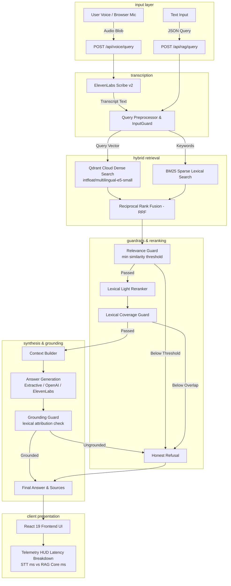

# langrag

- **Deployed Link:** https://task2-phi-kohl.vercel.app/
- **Demo Video:** https://drive.google.com/file/d/1VOzZuKd-Jfx5NiRu6oMUOtoWiO4wa2WB/view?usp=sharing

voice-enabled retrieval-augmented generation over multilingual ms marco (ai4bharat msmarco-xi).

you speak a question, the backend transcribes it via elevenlabs stt, pulls relevant passages from a hybrid dense and sparse index (qdrant cloud + bm25), checks for relevance and hallucinations, and returns a grounded answer.


---

## architecture

the whole thing runs through one unified rag pipeline whether the input comes in as audio or text:



---

## dataset and indexing

the index is built on a validated hindi and english subset from [ai4bharat/msmarco-xi](https://huggingface.co/datasets/ai4bharat/msmarco-xi):

- query records: 500
- candidate passages: 9,989
- total indexed chunks: 11,478
- vector index: qdrant cloud (`langrag_prod`, 384 dimensions, cosine distance)
- sparse index: persisted postings-based bm25 index (`data/indexes/bm25.pkl`)

---

## chunking strategies

we implemented four distinct chunking strategies in `rag/chunking/` rather than relying on a single fixed splitter:

- `fixed`: character-based window with sliding overlap.
- `sentence`: sentence-boundary splitter supporting both latin (`.`, `?`, `!`) and devanagari punctuation (`।`, `॥`).
- `semantic`: groups consecutive sentences based on cosine similarity distance.
- `metadata_aware`: attaches document ids, language tags, passage positions, and field provenance to every generated chunk.

---

## retrieval and guardrails

1. **dense retrieval:** uses qdrant cloud hosted inference with `intfloat/multilingual-e5-small`.
2. **sparse retrieval:** custom postings-based bm25 implementation.
3. **rank fusion:** reciprocal rank fusion (rrf) merges rankings without needing score scale calibration.
4. **input guard:** validates query string length, encoding, and rejects empty or oversized requests.
5. **relevance guard:** checks candidate similarity scores. if the top result is below the relevance cutoff, the system refuses instead of answering blindly.
6. **coverage guard:** verifies substantive query token presence in retrieved evidence for extractive mode.
7. **grounding guard:** validates that the output answer shares sufficient lexical overlap with the retrieved passages to prevent hallucinations.

when the knowledge base does not contain the required facts, the system outputs:

> "I couldn't find enough relevant information in the provided knowledge base to answer this question."

---

## project structure

```text
langrag/
├── backend/
│   ├── app/
│   │   ├── api/routes/          # /api/rag/query, /api/voice/query, /health
│   │   ├── core/                # settings, rate limiting, logging, exceptions
│   │   ├── models/              # pydantic schemas
│   │   ├── dependencies.py      # pipeline wiring
│   │   └── main.py              # fastapi app
│   ├── rag/
│   │   ├── chunking/            # fixed, sentence, semantic, metadata chunkers
│   │   ├── retrieval/           # qdrant cloud, bm25, rrf fusion
│   │   ├── guardrails/          # input, relevance, coverage, grounding guards
│   │   ├── generation/          # extractive, openai, elevenlabs providers
│   │   ├── stt/                 # elevenlabs scribe v2 speech-to-text
│   │   └── pipeline.py          # main rag orchestrator
│   ├── evaluation/              # retrieval and latency evaluation metrics
│   ├── scripts/                 # ingest, inspect_dataset, benchmark scripts
│   ├── tests/                   # pytest unit & integration tests
│   ├── pyproject.toml           # uv package definitions and ruff config
│   ├── Dockerfile.free          # optimized render free container
│   └── Dockerfile.local         # local development container
├── frontend/
│   ├── src/                     # react 19, typescript, vite UI
│   ├── nginx.conf               # ssl reverse proxy config
│   └── Dockerfile               # frontend container
├── data/
│   ├── indexes/                 # serialized bm25 index
│   └── smoke/                   # test audio files (.wav)
└── docker-compose.yml           # local multi-container compose
```

---

## setup and local run

### using uv (recommended)

**prerequisites:** python 3.11+, node.js 20+, and uv.

```bash
# 1. install backend dependencies with uv
cd backend
uv sync --all-extras

# 2. copy env file and set your keys
cp .env.example .env

# 3. start the backend server
uv run uvicorn app.main:app --reload --host 127.0.0.1 --port 8000
```

```bash
# 4. in another terminal, run frontend
cd frontend
npm install
npm run dev
```

### running with docker compose

```bash
# builds and starts backend, frontend with https, and qdrant
docker compose up --build -d
```

- frontend: `https://localhost:5174` (or `http://localhost:5173`)
- backend api: `http://localhost:8001`
- health check: `http://localhost:8001/health`

---

## running tests and linter

```bash
# run test suite with uv
cd backend
uv run pytest

# run ruff linter
uv run ruff check .

# format code
uv run ruff format .
```

---

## contributors

<table>
  <tr>
    <td align="center">
      <a href="https://github.com/ManjeetMMIV">
        <br />
        <sub><b>Manjeet Arvind Singh</b></sub>
      </a>
    </td>
    <td align="center">
      <a href="https://github.com/swar09">
        <br />
        <sub><b>swar09</b></sub>
      </a>
    </td>
  </tr>
</table>
